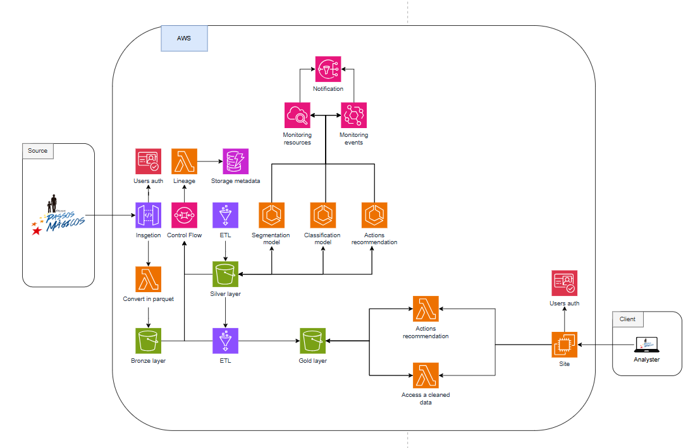

# Desafio:  

PÓS TECH - DATATHON  
Datathon: Case Passos Mágicos  
Mudando a vida de crianças e jovens por meio da educação A Associação Passos Mágicos tem uma trajetória de 32 anos de atuação e trabalha na transformação da vida de crianças e jovens de baixa renda, os levando a melhores oportunidades de vida. A transformação, idealizada por Michelle Flues e Dimetri Ivanoff, começou em 1992, atuando dentro de orfanatos no município de Embu-Guaçu.  
Em 2016, depois de anos de atuação, eles decidem ampliar o programa para que mais jovens tivessem acesso a essa fórmula mágica para transformação que inclui: educação de qualidade, auxílio psicológico/psicopedagógico, ampliação de sua visão de mundo e protagonismo. Passaram então a atuar como um projeto social e educacional, criando assim a Associação Passos Mágicos.

--
# Arquitetura proposta:


--

# Passos Mágicos - Plataforma MLOps com AWS CDK (Versão 2)

Projeto completo em **Python + AWS CDK v2** para ingestão, tratamento, treinamento, serving e monitoramento de um modelo preditivo de risco de defasagem escolar.

## O que esta versão 2 adiciona
- documentação de arquitetura para apresentação
- guia de deploy para **conta específica em us-east-1 (N. Virginia)**
- `app.py` parametrizado por **conta + região + stage**
- scripts prontos de deploy para **Linux/Mac** e **Windows PowerShell**
- instruções mais objetivas sobre o que alterar antes de rodar

## Arquitetura
- **S3 (medallion)**: `bronze/`, `silver/`, `gold/`, `artifacts/`, `predictions/`, `monitoring/`
- **SQS + Lambda container**: ingestão orientada a eventos
- **Glue**: ETL e Data Quality
- **Step Functions**: orquestração end-to-end
- **ECS Fargate**: treinamento containerizado do modelo
- **FastAPI em Lambda container**: endpoint `/predict`
- **DynamoDB**: metadata de execução
- **CloudWatch Dashboard + métricas customizadas**: monitoramento e drift
- **Athena**: consulta aos dados no data lake

## Estrutura
```text
app.py
cdk.json
infra/
  stacks/
docs/
  ARCHITECTURE_V2.md
  DEPLOY_US_EAST_1.md
scripts/
  deploy_us_east_1.sh
  deploy_us_east_1.ps1
src/
  api/
  lambda_ingest/
  glue/
  training/
  monitoring/
  shared/
tests/
```

## O que alterar antes do deploy
Edite o arquivo `cdk.json`:

```json
{
  "app": "python app.py",
  "context": {
    "project_name": "passos-magicos",
    "stage": "dev",
    "account": "123456789012",
    "region": "us-east-1"
  }
}
```

Troque apenas:
- `account`: pelo ID da sua conta AWS
- `stage`: `dev`, `hml` ou `prod`
- `project_name`: se quiser personalizar os nomes dos recursos

## Deploy rápido

### Linux / Mac
```bash
./scripts/deploy_us_east_1.sh 123456789012 passos-magicos dev
```

### Windows PowerShell
```powershell
.\scripts\deploy_us_east_1.ps1 -AccountId 123456789012 -ProjectName passos-magicos -Stage dev
```

## Deploy manual
```bash
python -m venv .venv
source .venv/bin/activate
pip install -r requirements.txt
npm install -g aws-cdk
aws sts get-caller-identity
cdk bootstrap aws://123456789012/us-east-1
cdk synth
cdk deploy --all --require-approval never
```

## Fluxo operacional
1. Um evento é publicado na fila de ingestão.
2. A Lambda container grava o arquivo bruto em `bronze/` e registra metadata no DynamoDB.
3. A Step Function executa:
   - job de ETL do Glue
   - job de Data Quality do Glue
   - container de treinamento no ECS
   - função de monitoramento inicial
4. O modelo treinado é salvo em `artifacts/models/` no S3.
5. A API FastAPI carrega o artefato mais recente e responde no endpoint `/predict`.
6. Cada predição gera logs em `predictions/` e métricas de monitoramento.

## Testes
```bash
pytest --cov=src --cov=infra --cov-report=term-missing
```

## Documentação adicional
- `docs/ARCHITECTURE_V2.md`: visão arquitetural para apresentação
- `docs/DEPLOY_US_EAST_1.md`: passo a passo para deploy no ambiente específico

## Observações importantes
- o projeto cria **VPC com NAT Gateway**, então haverá custo contínuo enquanto a stack existir
- para demonstração do Datathon, prefira usar `stage=dev`
- após finalizar os testes, destrua o ambiente com:

```bash
cdk destroy --all
```
Arquitetura:
image.png

## Infraestrutura em CDK (AWS)

### Visão geral

Toda a infraestrutura de MLOps do datathon é provisionada com **AWS CDK (Python)** no diretório `cdk/`.  
O mesmo código suporta múltiplos ambientes (por exemplo `dev` e `prod`) apenas mudando o parâmetro lógico de estágio.

- **Data Lake (S3)**: bucket versionado organizado em camadas `raw/xlsx`, `raw/parquet`, `silver/`, `gold/`.
- **Ingestão via API Gateway + Lambda**: recebe arquivos `.xlsx` pela API e grava em `raw/xlsx/`.
- **Conversão para Parquet (Lambda)**: função disparada por eventos S3 que converte `xlsx` → `parquet` e grava em `raw/parquet/`.
- **ETL (AWS Glue + Step Functions)**: job Glue com script em `source/glue/map_and_standardize_job.py` e orquestração por Step Functions.
- **Metadados e controle**: fila SQS para eventos de pipeline e tabela DynamoDB para status/metadados.
- **Serviço de inferência (ECS + FastAPI)**: esqueleto de serviço FastAPI em Fargate com Load Balancer público.

### Parâmetros de ambiente (dev/prod)

O arquivo `cdk/app.py` lê o estágio (ambiente lógico) nessa ordem:

1. Contexto CDK: `-c stage=dev` ou `-c stage=prod`
2. Variável de ambiente `STAGE`
3. Fallback: `dev`

O nome da stack segue o padrão: `PassosMagicosDatathon-{stage}`.  
O bucket S3 também é nomeado com o estágio: `passos-magicos-datathon-{stage}-{account}-{region}`.

Exemplos de synth/deploy:

- Ambiente de desenvolvimento:
  - `cd cdk`
  - `cdk synth -c stage=dev`
  - `cdk deploy -c stage=dev`
- Ambiente de produção:
  - `cd cdk`
  - `cdk synth -c stage=prod`
  - `cdk deploy -c stage=prod`

### Fluxo de ingestão e conversão (xlsx → parquet)

1. **Upload via API**  
   - Endpoint: `POST /upload` exposto pelo **API Gateway** (`aws_apigateway.LambdaRestApi`).  
   - Backend: Lambda `ingestion_api.handler` (`cdk/source/lambdas/ingestion_api.py`).  
   - Formas de envio:
     - **Binário**: enviar o arquivo `.xlsx` como corpo da requisição com `isBase64Encoded=true` (configuração padrão do API Gateway proxy) e query string `?file_name=nome_arquivo.xlsx`.
     - **JSON**: enviar um JSON contendo `"file_content"` em base64 e, opcionalmente, `"file_name"`.
   - A Lambda grava o arquivo no bucket de Data Lake em `raw/xlsx/` com um nome único.

2. **Disparo da conversão**  
   - A criação de um objeto `.xlsx` em `raw/xlsx/` dispara a Lambda `convert_extension.handler` (`cdk/source/lambdas/convert_extension.py`) via evento **S3 ObjectCreated**.
   - Essa Lambda:
     - Lê o arquivo `.xlsx` do bucket.
     - Lê todas as abas com `pandas` + `openpyxl`.
     - Para cada aba, gera um `.parquet` com `pyarrow`.
     - Grava os arquivos em `raw/parquet/` dentro do mesmo bucket.

3. **Persistência final**  
   - Os dados convertidos ficam disponíveis para as camadas seguintes (Silver/Gold e consumo por Athena, Glue e modelos de ML).

### ETL, qualidade de dados e preparação para ML

- O script Spark de padronização e preparação (`cdk/source/glue/map_and_standardize_job.py`) é publicado automaticamente no bucket S3 em `scripts/glue/` via `BucketDeployment`.
- Um **AWS Glue Job** é criado para executar esse script, com papel de serviço configurado para ler/escrever no Data Lake.
- Uma **State Machine do Step Functions** orquestra a execução do Glue Job (início, espera e término), permitindo automatizar:
  - ingestão,
  - processamento ETL,
  - validações de qualidade,
  - preparação de datasets em camadas *Silver* e *Gold*.

### Metadados, monitoramento e recomendação

- **SQS**: fila `EtlQueue` para acionar/registrar eventos de pipeline (por exemplo, novos arquivos ingeridos e etapas concluídas).
- **DynamoDB**: tabela `PipelineMetadata` com `pk` e `sk` para registrar estado das execuções (ingestão, Glue, treinamento, deploy, monitoramento).
- **CloudWatch Logs**:
  - Lambdas de ingestão e conversão têm grupos de logs com política de retenção diferente para `dev` e `prod`.
  - A State Machine registra todos os eventos em um LogGroup dedicado.

### Serviço de inferência (FastAPI em ECS/Fargate)

- A stack cria:
  - uma **VPC**,
  - um **Cluster ECS**,
  - um serviço **Application Load Balanced Fargate** para hospedar a API FastAPI de previsões (`/predict`).
- A imagem de container é, por padrão, um placeholder (`python:3.11-slim`) e deve ser substituída pela imagem real da API (buildado com Docker e publicado em ECR).
- O serviço recebe variáveis de ambiente com:
  - `DATA_BUCKET` (bucket do Data Lake),
  - `STAGE` (dev/prod),
  permitindo que a aplicação leia modelos versionados (pickle/joblib) em S3 e faça as previsões de risco.

