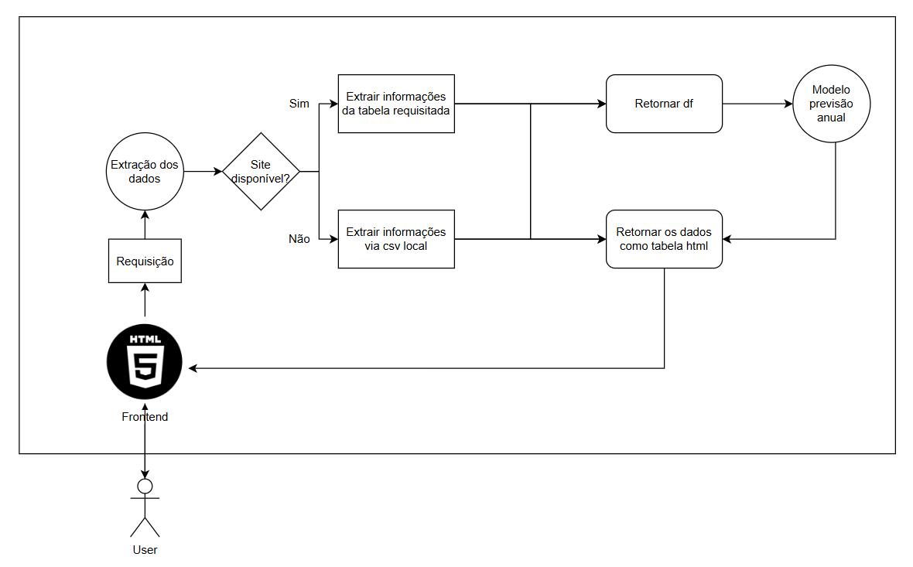

# 🍇 Grape Challenge - Embrapa Data API

## 📘 Introdução

Este projeto é a primeira entrega do **Tech Challenge** da **FIAP** para o curso de **Machine Learning Engineer**. Seu principal objetivo é criar uma **API REST em Python** capaz de consultar dados da produção de uva, vinho e derivados diretamente do site da **Embrapa Uva e Vinho**, estruturando essas informações para posterior uso em cenários de análise de dados e machine learning.

### 🎯 Objetivos

- ✅ Criar uma **REST API** em Python que faça a consulta no site da Embrapa.
- ✅ Documentar a API com o Swagger UI (fornecido nativamente pelo FastAPI).
- ✅ Implementar autenticação com JWT (opcional, mas recomendado).
- ✅ Planejar a arquitetura de deploy com ingestão e preparação para uso em modelos de ML.
- ✅ Realizar o **MVP com deploy em nuvem**, fornecendo:
  - 🌐 Um link compartilhável
  - 📁 Um repositório no GitHub

---

## 🧠 Arquitetura Pensada

A arquitetura do projeto contempla:

1. **Ingestão** via web scraping direto do site da Embrapa.
2. Processamento de dados via pandas e organização em DataFrames.
3. Visualização dos dados com HTML dinamicamente renderizado por Jinja2.
4. Autenticação de usuários por meio de **JWT**.
5. **Deploy serverless na Vercel**, acessível publicamente para consultas e navegação.

---

## 🗂️ Estrutura de Pastas

project/  
│  
├── app.py # Arquivo principal da aplicação  
├── vercel.json # Configuração do deploy para Vercel  
├── requirements.txt # Dependências do projeto  
├── readme.md # Este arquivo  
├── api/ # Contém apenas a chamada para o app para direcionar o vercel  
│ └── index.py  
|  
├── assets/ # Imagens e arquivos estáticos  
│ └── images/  
│  
├── data_extraction/ # Lógica para scraping de dados da Embrapa  
│ └── data_extraction.py  
│  
├── routers/ # Rotas organizadas por funcionalidade  
│ └── auth.py  
│ └── login.py  
│ └── tables.py  
│  
├── views/ # Templates HTML para renderização de dados  
│ └── home.html  
│ └── login.html  
│ └── product.html  
│  
└── env/ # Variáveis de ambiente (não versionadas)  

---

📊 Funcionalidades Disponíveis  

◆ Produção de vinhos  

◆ Comercialização  

◆ Exportações:  
    ◈ Espumantes  
    ◈ Suco  
    ◈ Uva  
    ◈ Vinho  

◆ Importações:  
    ◈ Espumantes  
    ◈ Suco  
    ◈ Uvas frescas  
    ◈ Uvas passas  
    ◈ Vinho  

◆ Processamento:  
    ◈ Uvas americanas híbridas  
    ◈ Uvas de mesa  
    ◈ Uvas viníferas  
    ◈ Não classificadas  

⚠️ Observações para Deploy  
Para testar recursos utilizando o swagger basta estar logado e acessar [`/docs`](https://fiap-mle-challenge1-git-main-0verthrives-projects.vercel.app/docs)

Parâmetros existentes:  

    Em ano as opções vão de 1970-2024
    
    Em Exportação as opções são:
    "exp_espumantes",
        "exp_suco",
        "exp_uva",
        "exp_vinho"
    
    Em Importação as opções são:
        "imp_espumantes",
        "imp_uvas_frescas",
        "imp_uvas_passas",
        "imp_suco",
        "imp_vinho"
    
    Em Processamento as opções sâo:
        "proc_viniferas",
        "proc_americanas_hibridas",
        "proc_uvas_mesa",
        "proc_sem_classificacao"

📎 Link do Projeto:  
🔗 https://fiap-mle-challenge1-git-main-0verthrives-projects.vercel.app/  

📎 Fonte das consultas:
🔗 http://vitibrasil.cnpuv.embrapa.br/index.php?

👥 Autores
Sara Lessa

Curso: FIAP - Machine Learning Engineer