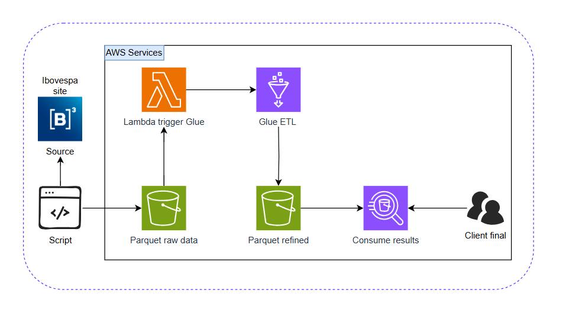

# Objetivo
Construir uma pipeline de dados completo para extrair, processar e analisar dados do pregão da B3, utilizando AWS S3, Glue, Lambda e Athena.

# Arquitetura


# CDK Infrastructure - Projeto B3 MLE

Este diretório contém a infraestrutura como código (IaC) do projeto, utilizando o [AWS CDK (Cloud Development Kit)](https://docs.aws.amazon.com/cdk/v2/guide/home.html) em Python. O objetivo é provisionar recursos AWS necessários para o pipeline de dados da B3, incluindo S3, Glue e Lambda.

## Estrutura

- **cdk_stack.py**: Stack principal que orquestra os recursos.
- **s3_stack.py**: Criação e deploy de bucket S3.
- **lambda_stack.py**: Função Lambda para acionar o Glue Job.
- **glue_stacks.py**: Glue Database, Table e Job.
- **source/**: Scripts de Lambda, Glue e arquivos armazenados no s3.
- **config/**: Arquivos de configuração YAML.

## Pré-requisitos

- Python 3.8+
- [AWS CLI](https://aws.amazon.com/cli/) configurado
- [Node.js](https://nodejs.org/) (para o CDK)
- [AWS CDK Toolkit](https://docs.aws.amazon.com/cdk/v2/guide/cli.html) instalado globalmente:
  ```sh
  npm install -g aws-cdk
  ```

## Instalação e Execução Local

1. **Instale as dependências Python:**
   ```sh
   cd cdk
   python -m venv .venv
   # Linux/Mac
   source .venv/bin/activate
   # Windows
   .venv\Scripts\activate.bat
   pip install -r requirements.txt
   ```

2. **(Opcional) Instale dependências de desenvolvimento:**
   ```sh
   pip install -r requirements-dev.txt
   ```

3. **Configure as variáveis em `config/config.yaml` e `config/enviroments.yaml` conforme necessário.**

4. **Compile e visualize o template CloudFormation:**
   ```sh
   cdk synth
   ```

5. **Faça o deploy dos recursos na AWS:**
   ```sh
   cdk deploy
   ```

6. **Para remover os recursos:**
   ```sh
   cdk destroy
   ```

## Testes

Para rodar testes unitários (exemplo em `tests/unit/`):

```sh
pytest
```

---

**Observação:** Certifique-se de que seu usuário AWS tem permissões para criar os recursos necessários (S3, Glue, Lambda, IAM).

---