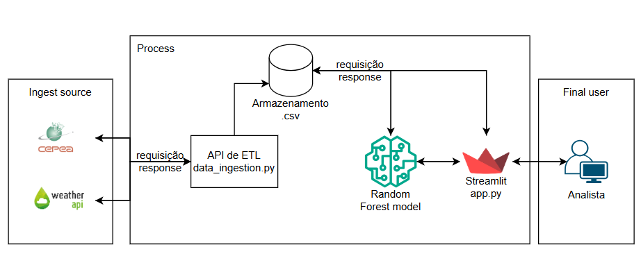

# Desafio FIAP – Machine Learning Engineering

## 📌 Introdução

Este projeto faz parte do curso de Machine Learning Engineering da FIAP e contempla as seguintes etapas:

1. **Coleta de Dados:** Desenvolver uma API para coletar dados e armazená-los em banco de dados, Data Warehouse ou Data Lake.
2. **Modelagem:** Construir um modelo de Machine Learning utilizando a base de dados criada.
3. **Documentação:** Manter o código e documentação organizados no GitHub.
4. **Storytelling:** Apresentar o processo e resultados em vídeo explicativo (link do YouTube + repositório).
5. **Aplicação:** Disponibilizar o modelo em ambiente produtivo (aplicação simples ou dashboard).

## 🎯 Objetivo

Prever o custo do café para a semana seguinte, utilizando dados históricos de preços e clima.

## 🏗️ Arquitetura



## 📁 Estrutura de Pastas

```
project/
│
├── incoming/         # APIs de ETL (extração, transformação e carregamento)
│   ├── cepea.py
│   ├── move.py
│   ├── convert.py
│   ├── weather.py
│   ├── data_ingestion.py
│   └── readme.md
│
├── model/            # Treinamento e avaliação do modelo
│   ├── predict_model.ipynb
│   └── readme.md
│
├── source/           # Armazenamento dos dados e modelo
│   ├── model/        # Arquivos .pkl do modelo treinado
│   ├── raw_files/
│   │   ├── cepea/    # Dados brutos de preços (.csv, .xls)
│   │   └── weather/  # Dados brutos de clima (.csv)
│   └── training_data/ # Dados finais para treino (.csv)
│
├── image/            # Imagens do projeto (.png)
├── app.py            # Aplicação Streamlit
├── requirements.txt  # Dependências do projeto
└── readme.md         # Documentação principal
```

## 🖥️ Como Executar Localmente

1. **Crie um ambiente virtual:**
   ``` bash
   python -m venv venv
   ```
   ou
   ``` bash
   python3 -m venv venv
   ```

2. **Ative o ambiente virtual:**
   ``` bash
   venv\Scripts\activate
   ```

3. **Instale as dependências:**
   ``` bash
   pip install -r requirements.txt
   ```

4. **Crie o arquivo de variáveis de ambiente `.env`:**
   - No terminal (dentro da pasta do projeto):
     ``` bash
     type nul > .env
     ```
   - Ou crie manualmente na IDE.

5. **Configure as variáveis no arquivo `.env`:**
   ``` text
   DOWNLOAD_PATH="caminho/para/pasta/download"
   CEPEA_PATH="/source/raw_files/cepea"
   WEATHER_PATH="/source/raw_files/weather"
   TRAINING_DATA_PATH="/source/training_data"
   MODEL_PATH="/source/model"
   ```
   > *Se houver erro de caminho, utilize o caminho absoluto.*

6. **Execute a aplicação:**
   ``` bash
   streamlit run app.py
   ```
   > *Certifique-se de estar no diretório `project` ao rodar o comando.*

## ℹ️ Informações Gerais

- O diretório **incoming/** contém as APIs de ETL, responsáveis pela extração, transformação e carregamento dos dados. Todos os dados capturados são salvos em formato CSV. Detalhes sobre cada API estão no `readme.md` da pasta.
- O diretório **model/** reúne o pré-processamento, treinamento, avaliação e exportação do modelo. Para detalhes sobre o modelo, acesse o `readme.md` da pasta.
- O diretório **source/** organiza os dados:
  - **raw_files/**: Armazena os dados brutos extraídos das APIs.
  - **training_data/**: Contém os dados tratados e unificados, usados para treinar o modelo.
  - **model/**: Guarda o modelo final treinado (.pkl).

---