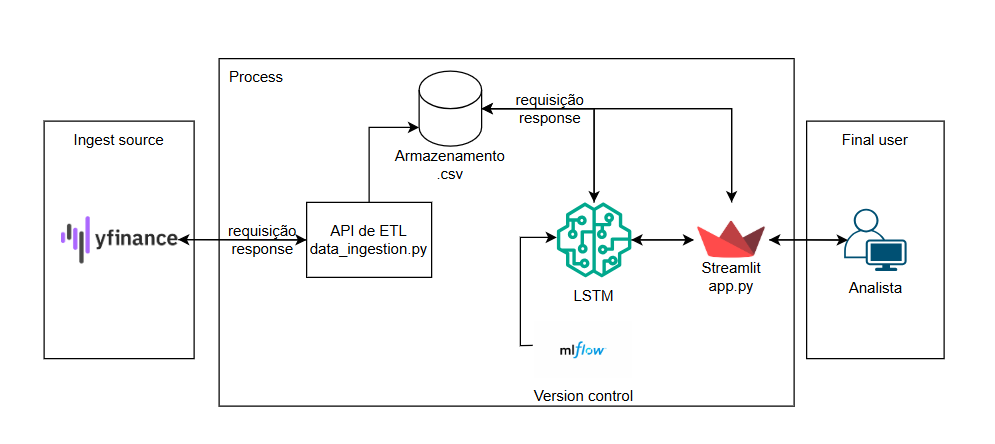

# 📈 Desafio – Previsão de Preços de Ações com LSTM

## 🎯 Objetivo

Desenvolver um **modelo preditivo baseado em redes neurais Long Short-Term Memory (LSTM)** capaz de prever o **valor de fechamento (Close)** de ações de uma empresa à escolha.

O desafio contempla **toda a pipeline de Machine Learning**, desde:

- Extração e tratamento dos dados  
- Treinamento e validação do modelo  
- Versionamento com MLflow  
- Deploy do modelo em uma aplicação interativa (API / Dashboard)  
- Disponibilização de previsões futuras de preços  

---

## 🧠 Arquitetura da Solução

A arquitetura foi pensada para garantir:

- **Separação clara de responsabilidades**
- **Reprodutibilidade**
- **Facilidade de manutenção e evolução**
- **Boas práticas de MLOps**



---

## 📂 Estrutura de Pastas

```text
project/
│
├── data/
│   ├── raw/                # Dados brutos extraídos (Yahoo Finance)
│   └── processed/          # Dados tratados e prontos para modelagem
│
├── models/                 # Modelos treinados e scalers persistidos
│
├── source/
│   ├── extraction.py       # Extração de dados (Yahoo Finance)
│   ├── transformation.py  # Limpeza, padronização e normalização
│   ├── prepare_data.py    # Preparação de janelas temporais (TimeSeries)
│   ├── lstm_model.py       # Definição e treinamento do modelo LSTM
│   ├── validation_model.py# Validação e métricas do modelo
│   ├── persist_model.py   # Orquestra treino, validação e persistência
│   ├── inference.py       # Inferência e previsões futuras
│
├── testes/
│   └── test_ed.py          # Testes de extração e processamento
│
├── app.py                  # Aplicação Streamlit (Dashboard)
└── requirements.txt
```

---

## 🚀 Deploy da Aplicação

📌 **Link do deploy:**  
> [Aplicação implementada](https://fiap-mle-challenge-man4xipjrkbxvp2csoyxij.streamlit.app/)

---

## ▶️ Como Executar Localmente

### 1️⃣ Clonar o repositório

```bash
git clone <url-do-repositorio>
cd project
```

---

### 2️⃣ Criar e ativar o ambiente virtual

Crie um ambiente virtual para isolar as dependências do projeto:

```bash
python -m venv venv
source venv/bin/activate  # Linux/Mac
venv\Scripts\activate   # Windows
```

---

### 3️⃣ Instalar as dependências

Com o ambiente virtual ativado, instale todas as dependências do projeto:

```bash
pip install -r requirements.txt
```

---

### 4️⃣ Definir as variáveis de ambiente

Crie um arquivo .env na raiz do projeto ou configure as variáveis diretamente no sistema operacional:
```text
PATH_RAW_DATA
PATH_PROCESSED_DATA
PATH_PROCESSED
MODEL_PATH
SCALER_PATH
```

Essas variáveis são responsáveis por definir os caminhos de:

 - Dados brutos (raw)

 - Dados processados

 - Modelo treinado

 - Scaler utilizado no treinamento e inferência

---

### 5️⃣ Extração e processamento dos dados

Para extrair novos dados e realizar o processamento inicial:
```bash
python testes/test_ed.py
```

Em seguida, execute o pipeline de treinamento, validação e persistência do modelo:
```bash
python source/persist_model.py
```

---

### 6️⃣ Visualizar experimentos no MLflow

Para acompanhar métricas, parâmetros e versões do modelo, execute:
```bash
mlflow ui
```

A interface web do MLflow estará disponível em:
```arduino
http://localhost:5000
```

---

### 7️⃣ Executar o Streamlit (Dashboard)

Para iniciar a aplicação interativa:
```bash
streamlit run app.py
```

A aplicação estará disponível em:
```arduino
http://localhost:8501
```

**⚠️ Observação importante:**
Certifique-se de estar dentro do diretório project/ ao executar o comando ou utilize o caminho completo até o arquivo app.py.

---

📊 Funcionalidades da Aplicação

 - Visualização do histórico de preços

 - Análise de volatilidade

 - Visualização dos dados utilizados no treinamento

 - Upload de dados históricos pelo usuário

 - Previsão dos preços para os próximos 5 dias

 - Versionamento e rastreabilidade do modelo via MLflow

---

### ✅ Conclusão

Este projeto demonstra a aplicação prática de LSTM para séries temporais financeiras, seguindo boas práticas de:

 - Engenharia de Dados

 - Machine Learning

 - MLOps

Com foco em:

 - Organização

 - Reprodutibilidade

 - Clareza arquitetural

 - Deploy funcional