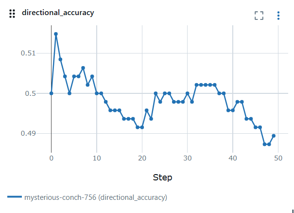
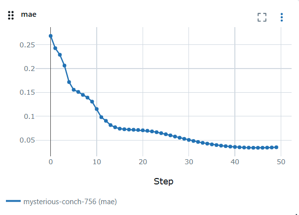
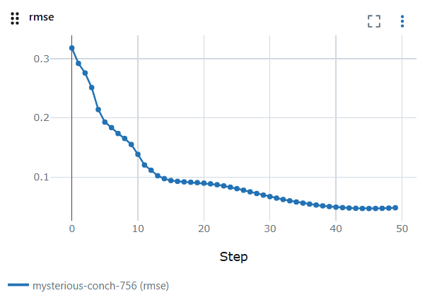
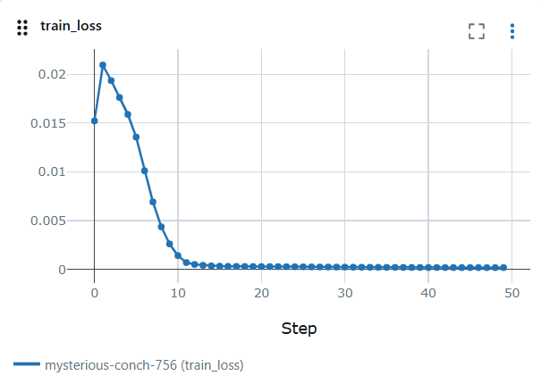
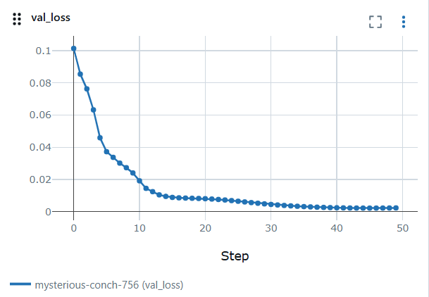
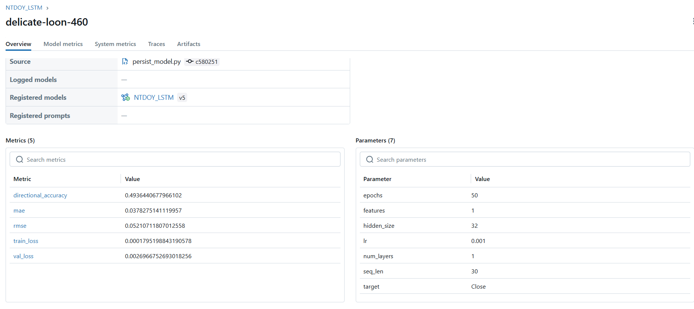

# 📦 Source — Pipeline de Dados e Modelagem LSTM

Este diretório contém todos os módulos responsáveis pelo **pipeline completo de dados e modelagem**, desde a extração dos dados financeiros até a inferência do modelo LSTM treinado.

O fluxo segue uma arquitetura em camadas, separando claramente responsabilidades de **extração**, **transformação**, **treinamento**, **validação**, **persistência** e **inferência**.

---

## 🧭 Visão Geral do Fluxo

```text
Yahoo Finance
      ↓
extraction.py  →  raw/
      ↓
transformation.py  →  processed/
      ↓
prepare_data.py
      ↓
lstm_model.py
      ↓
validation_model.py
      ↓
persist_model.py  →  modelo salvo
      ↓
inference.py  →  previsões
```

---

## 📄 extraction.py

Responsável pela **extração de dados brutos** a partir do Yahoo Finance.

### Funções

#### `fetch_data(symbol)`
Extrai dados históricos de mercado (**Open, High, Low, Close, Volume**) a partir de um símbolo de empresa  
(ex: `AAPL`, `PETR4.SA`).

#### `persist_data(df, path)`
Persiste os dados extraídos em formato **CSV** para uso posterior no modelo LSTM.

#### `get_data(symbol, path)`
Função orquestradora que:
- Extrai os dados do Yahoo Finance
- Salva os dados na camada **raw**

---

## 🔄 transformation.py

Responsável pela **limpeza, padronização e normalização** dos dados extraídos.

### Classe: `Transformer`

### Métodos

#### `get_data()`
Carrega os dados da camada **raw**.

#### `clean_data()`
Remove registros duplicados e garante consistência do dataset.

#### `standardize_date()`
Padroniza a coluna de data, removendo informações de horário.

#### `standardize_values()`
Arredonda os valores das colunas:
- `Open`
- `High`
- `Low`
- `Close`  
para **duas casas decimais**.

#### `save_data()`
Persiste os dados transformados na camada **processed**.

#### `normalize_data()`
Método principal que executa todo o pipeline de transformação:
- Carrega dados brutos
- Limpa e padroniza
- Salva os dados processados

---

## 🧪 prepare_data.py

Responsável por **preparar os dados** para o modelo LSTM.

### Funcionalidades

- Divide o dataset em:
  - **X:** janelas temporais (sequências)
  - **y:** valor alvo (ex: próximo preço de fechamento)
- Garante o formato esperado pelo modelo LSTM:

---

## 🧠 lstm_model.py

Responsável pelo **treinamento do modelo LSTM**.

### Responsabilidades

- Definição da arquitetura do modelo
- Treinamento com os dados preparados
- Controle de:
- Número de épocas
- Batch size
- Função de perda
- Retorno do modelo treinado

---

## 📊 validation_model.py

Responsável pela **validação do modelo treinado**.

### Funcionalidades

- Avalia a saída do modelo utilizando métricas como:
- **MSE**
- **RMSE**
- **MAE** (quando aplicável)
- Retorna métricas utilizadas para decisão de persistência do modelo

---

## 💾 persist_model.py

Responsável por **orquestrar o pipeline de modelagem**.

### Funcionalidades

- Executa, em sequência:
- Preparação dos dados
- Treinamento do modelo
- Validação da performance
- Verifica se as métricas atingem um **threshold mínimo**
- Caso aprovado, persiste o modelo treinado no formato:
- `.pkl`

---

## 🔮 inference.py

Responsável pela **inferência do modelo**.

### Funcionalidades

- Carrega o modelo persistido
- Recebe uma janela de dados recentes
- Retorna a previsão de preços futuros
- Suporta **previsões autoregressivas**

---

## 📏 scaler.py

Responsável pelo **gerenciamento de escaladores (scalers)**.

### Funcionalidades

- Salva o scaler utilizado durante o treinamento
- Carrega o mesmo scaler durante a inferência
- Garante consistência entre **treino** e **predição**

---

## ⚠️ Observações Importantes

- O **mesmo scaler** deve ser utilizado em treino e inferência
- A separação por camadas facilita:
- Reprodutibilidade
- Manutenção
- Evolução do pipeline
- O pipeline foi projetado para **modelos de séries temporais baseados em LSTM**

--- 

## 📊 Métricas Utilizadas na Validação do Modelo

Para avaliar a performance do modelo LSTM, foram utilizadas métricas amplamente adotadas em problemas de **séries temporais e regressão**.

### 📐 Métricas Quantitativas

- **MSE (Mean Squared Error)**  
  Mede o erro médio quadrático entre os valores previstos e os valores reais.  
  Penaliza fortemente erros maiores, sendo sensível a outliers.

- **RMSE (Root Mean Squared Error)**  
  Raiz quadrada do MSE, expressa o erro na **mesma unidade da variável alvo** (preço).  
  Facilita a interpretação prática do erro do modelo.

- **MAE (Mean Absolute Error)**  
  Calcula a média dos valores absolutos dos erros de previsão.  
  Fornece uma medida mais robusta, menos sensível a outliers.

---

### 📈 Métricas de Acompanhamento via MLflow

Além das métricas quantitativas, o treinamento e a validação do modelo são monitorados continuamente através do **MLflow**, garantindo rastreabilidade e reprodutibilidade.

#### 🔁 Directional Accuracy

Métrica utilizada para avaliar a capacidade do modelo de **prever corretamente a direção do movimento do preço**, independentemente da magnitude do erro.

- Indica se o modelo acerta:
  - Alta vs. queda do preço
- Métrica especialmente relevante em cenários financeiros



---

### 📉 Métricas de Erro

#### MAE – Mean Absolute Error
Representa o erro médio absoluto entre valores previstos e reais ao longo do tempo.



#### RMSE – Root Mean Squared Error
Indica o erro médio com penalização maior para erros extremos.



---

### 🧠 Perda do Modelo Durante o Treinamento

#### Loss de Treino
Acompanha a evolução do erro durante o ajuste do modelo nos dados de treino.



#### Loss de Validação
Avalia a capacidade de generalização do modelo em dados não vistos.



---

### ✅ Considerações Finais

- A combinação das métricas permite avaliar:
  - Precisão numérica
  - Capacidade de generalização
  - Coerência direcional das previsões
- O uso do MLflow garante:
  - Versionamento do modelo
  - Histórico de experimentos
  - Comparação entre execuções

---

### Visão geral MLFlow:


